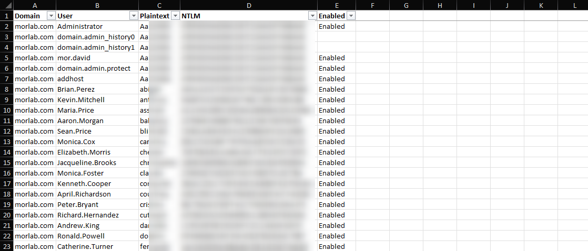
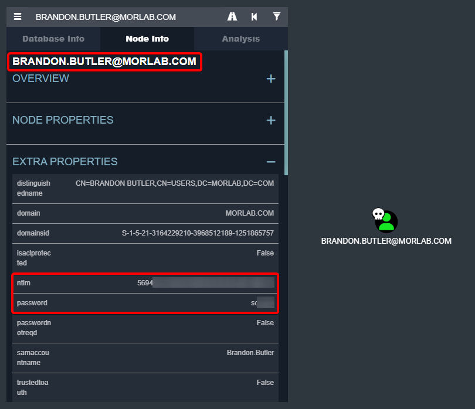

## Stay Updated on Telegram (RootSec - Cyber Write ups & Tools)
[https://t.me/root_sec](https://t.me/root_sec)

# DCSyncHound
DCSyncHound is a cyber-security tool designed to assist in protecting your Active Directory environment against potential threats and unauthorized access.\
This script analyzes the DCSync output file from several tools (such as Mimikatz, Secretsdump and SharpKatz...) and Hashcat's results and combine them into a single Excel file (xlsx) and load the details to your bloodhound.\
\


## NEW FEATURE: Data Loading to Bloodhound Database
Loading NTLMs and plain-text password to your Bloodhound database.\
*It's cool feature but you must take care and protect your bloodhound.*\
\


## Usage
```
Usage: DCSyncHound.py [-h] [--dburi DATABASEURI] [-u DATABASEUSER] [-p DATABASEPASSWORD] -d DOMAIN -f FILE_LOAD -t DCSYNC_TYPE -c FILE_CRACK -o OUTPUT_FILE [-b] [-v]

DCSyncHound - This script analyzes the DCSync output file from several tools (such as Mimikatz, Secretsdump and SharpKatz...) and Hashcat's results and combine them into a single Excel file (xlsx)

optional arguments:
  -h, --help            show this help message and exit
  --dburi DATABASEURI   Database URI
  -u DATABASEUSER, --dbuser DATABASEUSER
                        Database user
  -p DATABASEPASSWORD, --dbpassword DATABASEPASSWORD
                        Database password
  -d DOMAIN, --domain DOMAIN
                        Domain Name (example: lab.local)
  -f FILE_LOAD, --file FILE_LOAD
                        DCSync Output file
  -t DCSYNC_TYPE, --type DCSYNC_TYPE
                        Options: Mimikatz,Secretsdump,SharpKatz. Note: If you use mimikatz you need flags of /csv /all
  -c FILE_CRACK, --hashcat FILE_CRACK
                        Hashcat Output file
  -o OUTPUT_FILE, --output OUTPUT_FILE
                        Output file
  -b, --bloodhound      Data Loading to Bloodhound Database
  -v, --verbose         Verbose mode
```

## License
This program is distributed in the hope that it will be useful, but WITHOUT ANY WARRANTY; without even the implied warranty of MERCHANTABILITY or FITNESS FOR A PARTICULAR PURPOSE. See the GNU General Public License for more details.


<a href="https://www.buymeacoffee.com/mordavid" target="_blank"></a>
